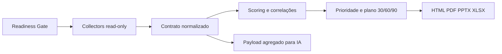

# Product Tour — SoftwareOne Assessment Security & Governance

## 1. O que é o produto

O engine transforma um discovery manual de Segurança, Governança Azure e ecossistema Microsoft em uma execução padronizada, somente leitura, com evidências, score, achados priorizados e plano de ação.

O objetivo não é apenas listar recursos. O produto conecta:

- postura de identidade e acesso;
- exposição e segurança Azure/M365;
- governança de subscriptions, policies, tags e RBAC;
- custos, ciclo de vida e oportunidades FinOps;
- Power Platform, Azure DevOps e dados/analytics;
- qualidade da evidência e limitações de licença/permissão;
- recomendações consultivas para 30, 60 e 90 dias.

## 2. Visão do fluxo



O Readiness Gate valida a sessão, o escopo, a disponibilidade do Azure CLI, o acesso de leitura e os guardrails antes de iniciar a coleta. Nenhuma etapa concede permissão ou modifica o tenant.

## 3. O que o engine coleta

| Domínio | Principais evidências | Quando indisponível |
|---|---|---|
| Identidade | usuários, convidados, contas desabilitadas, MFA, risco, último sign-in | `not_available` ou `partial` |
| Conditional Access | estado, escopo, exclusões, grant controls e cobertura | `not_available` se faltar `Policy.Read.All` |
| PIM/RBAC Entra | atribuições ativas/elegíveis, funções, escopo e permanência | limitações aparecem no manifesto |
| Aplicações | Enterprise Apps, App Registrations, credenciais expiradas e OAuth grants | inventário continua sem credenciais sensíveis |
| Segurança | Secure Score, Defender alerts e vulnerabilidades | não quebra se a licença não existir |
| Endpoints | dispositivos Entra e Intune quando disponível | estado desconhecido não vira conforme |
| Azure Governance | recursos, hierarquia, tags, exposição, owner e resource groups | depende de Reader e visibilidade do escopo |
| Azure Policy | compliance, não conformidades e isenções | ausência não é interpretada como conformidade |
| RBAC Azure | roles, principal, escopo, herança e risco | PIM e herança podem exigir enriquecimento |
| FinOps | custos agregados, grupos, tipos, anomalias, Advisor e lifecycle | Cost Management vira `partial`/`not_available` |
| Benefícios | Reservations e Savings Plans | sem inventar economia ou cobertura |
| Power Platform | Apps, Automate, ambientes, agentes, owners e conectores | depende do inventário disponível |
| Azure DevOps | projetos, repositórios, visibilidade, pipelines e políticas | integração opcional por PAT read-only |
| Dados/analytics | Purview, Synapse, Databricks, Fabric e Power BI por metadados | não lê conteúdo, datasets ou documentos |
| Compliance | auditoria administrativa agregada e Azure Policy | DLP/retention exigem integração Purview específica |
| Domínios M365 | SPF, DMARC e DKIM por DNS TXT | sem acesso a mensagens ou caixas |

## 4. Como o resultado é produzido

### 4.1 Normalização

Cada coletor retorna o mesmo contrato JSON, com:

- metadata da execução;
- escopo avaliado;
- registros normalizados;
- status do módulo;
- fonte da evidência;
- limitações;
- controles avaliados;
- achados e recomendações.

### 4.2 Scoring

O score considera somente controles com evidência suficiente. A ausência de permissão ou licença não recebe automaticamente score positivo.

Os domínios principais são:

- Identidade;
- Segurança;
- Governança;
- Custo;
- Compliance.

### 4.3 Correlações de risco

O engine cruza sinais para encontrar situações como:

- administrador sem MFA;
- convidado externo com privilégio;
- RBAC amplo em subscription ou Management Group;
- recurso público sem owner;
- aplicação com credencial expirada;
- consentimento OAuth de alto impacto;
- exposição pública combinada com tags incompletas.

Essas correlações são sinais de revisão, não declarações automáticas de incidente.

### 4.4 Priorização

Cada achado recebe:

- risco técnico;
- severidade;
- esforço relativo;
- prioridade P1/P2/P3;
- impacto executivo;
- confiança da evidência;
- sinal financeiro, somente quando quantificado;
- owner sugerido;
- dependências;
- plano 30/60/90.

## 5. O tour do relatório HTML

1. **Resumo executivo** — score geral, postura, riscos principais e mensagem para liderança.
2. **Readiness Gate** — mostra se o ambiente estava apto e quais pré-requisitos limitaram a execução.
3. **Saúde da execução** — apresenta módulos concluídos, parciais, indisponíveis e com erro.
4. **Mapa de cobertura** — mostra escopo esperado, fonte, registros, confiança e como destravar cada módulo.
5. **Dashboard de domínio** — radar e scores de Identidade, Segurança, Governança, Custo e Compliance.
6. **Principais riscos** — achados com evidência, recomendação, limitações e rastreabilidade.
7. **Matriz de priorização** — impacto, esforço, prioridade, frente consultiva e horizonte.
8. **Decisões executivas** — ações que a liderança pode encaminhar.
9. **Discovery técnico** — tabelas detalhadas de usuários, políticas, dispositivos, aplicações, RBAC, Policy e recursos.
10. **FinOps e ciclo de vida** — custos, órfãos, Advisor, aposentadorias e benefícios.
11. **Runbooks** — procedimentos de validação e correção, sempre fora do escopo automático do engine.
12. **Transparência** — limitações, cobertura e aviso de que o assessment não é certificação ou auditoria legal.

## 6. Artefatos gerados

| Arquivo | Uso |
|---|---|
| `assessment.html` | relatório completo offline, executivo e técnico |
| `assessment-executive-summary.pdf` | reunião executiva e impressão |
| `assessment-executive-summary.pptx` | apresentação para gestores e workshops |
| `assessment-action-plan.xlsx` | plano de ação operacional |
| `assessment.json` | contrato normalizado e rastreável |
| `ai-payload.json` | somente métricas agregadas para futura IA |
| `preflight.json` | readiness e escopos esperados |
| `pilot-validation.json` | aceite técnico da execução |
| `artifact-validation.json` | integridade dos arquivos entregues |
| `release-gate.json` | aprovação do pacote beta |

## 7. Privacidade e segurança

- O engine só executa operações de leitura.
- Não possui fluxo de remediação automática.
- Não solicita `Owner`, `Contributor` ou permissões de escrita.
- Segredos, tokens, certificados e conteúdo de negócio não entram no payload de IA.
- PII permanece fora da camada de IA.
- O HTML técnico pode conter dados detalhados do tenant e deve ser tratado como confidencial.
- A camada executiva deve ser revisada antes do envio ao cliente.
- Falhas de licença, permissão, retenção ou throttling são preservadas como limitações.

## 8. Demonstração sem tenant completo

Para apresentar a ferramenta sem depender de um ambiente com todas as licenças, execute:

```bash
./scripts/run-product-tour.sh
```

Isso gera três relatórios:

- `dist/tour/small/assessment.html`;
- `dist/tour/limited/assessment.html`;
- `dist/tour/full/assessment.html`.

Todos são sintéticos e carregam `metadata.simulation.is_simulation=true`. Eles servem para demonstrar comportamento, não para representar evidência de cliente.

## 9. Execução em tenant real

### Cloud Shell Linux

```bash
az login --tenant <tenant-id>
cd assessment-engine
chmod +x scripts/run-assessment.sh
./scripts/run-assessment.sh "<subscription-id>" full
```

### Cloud Shell PowerShell

```powershell
az login --tenant <tenant-id>
Set-Location ./assessment-engine
.\scripts\run-assessment.ps1 -Subscriptions "<subscription-id>" -Profile full
```

O runner instala dependências, executa o Readiness Gate, coleta os módulos em paralelo de forma conservadora, gera os artefatos e executa as validações locais.

## 10. Estado da Beta

O gate técnico da Beta está aprovado com testes automatizados, cenários sintéticos, validação de artefatos e guardrails read-only. A etapa que permanece operacionalmente obrigatória é o piloto autorizado em um tenant real, com comparação contra Portal Azure, Graph Explorer, Entra, Defender e Cost Management.

## 11. O que vem depois da Beta

- integração específica de Purview DLP e retention;
- Defender for Cloud mais detalhado;
- benchmark anônimo por vertical;
- resumo executivo com Azure OpenAI;
- tendências e portal do cliente;
- integração ampliada com ARI, AzGovViz, Maester, ScubaGear e CCOInsights;
- modelo comercial e operação recorrente.

Para a fase interna, use o [Plano de dogfooding](INTERNAL-DOGFOODING-PLAN.md) e o [modelo de registro de execução](RUN-LOG-TEMPLATE.md).
